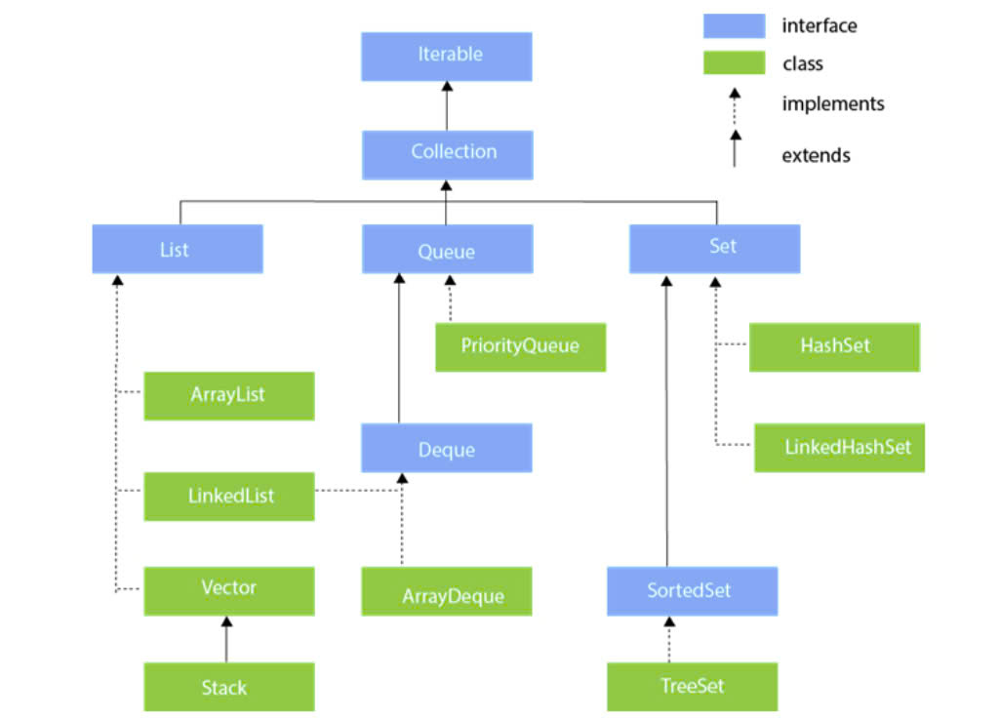
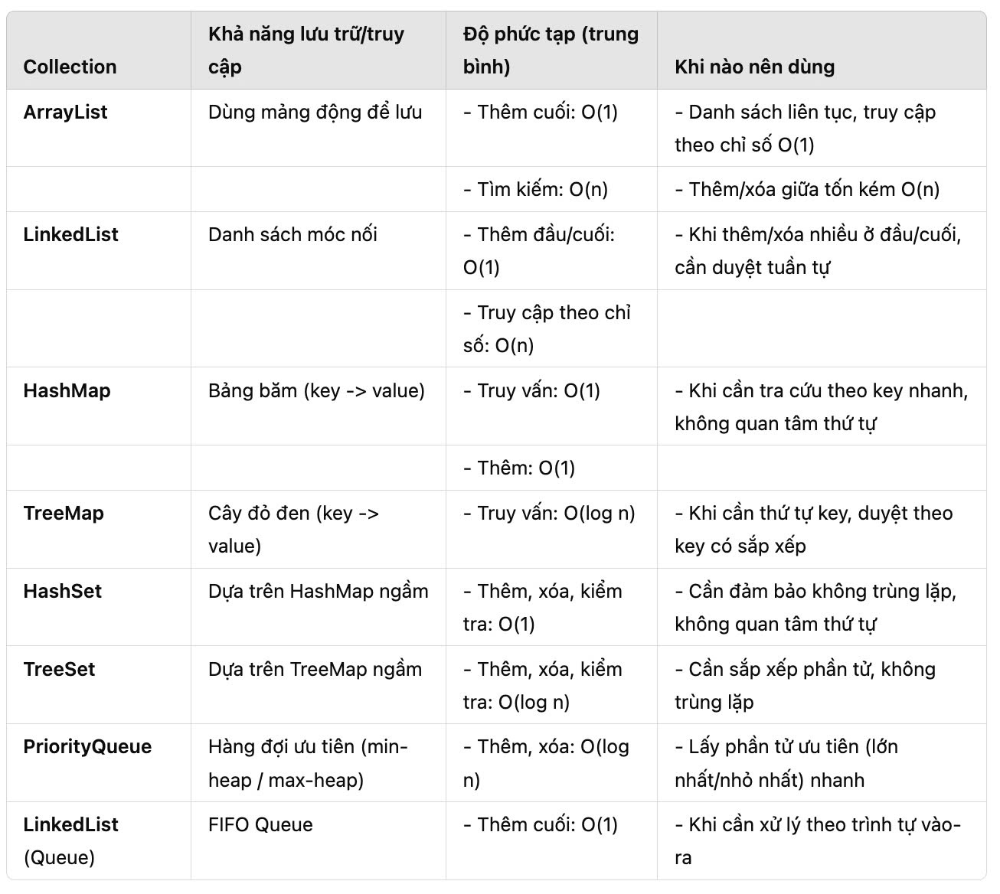

I, List Interface
List interface: Là Interface của collection interface, chúng ta có thể lưu trữ tập gợp các đối tượng có thứ tự
- List: Là một danh sách các phần tử có thứ tự. List chứa 2 hoặc nhiều các phần tử giống nhau
- Set: Là một danh sách các phần tử không có thứ tự.
- Map: Lưu các phần tử theo cặp giá trị(key, value), Ko cho phép cặp key trùng nhau.
- Queue: Lưu các pt theo công thức FiFo(First in First out)
  btvn thêm sửa xóa danh sách sinh viên
- array list
- linked list
- vector
- stack

* Kiếm thức học được

- isEmpty() và size dùng để kiểm tra chuỗi rỗng hay không
- Nhưng isEmpty() thường được ưu tiên vì nó có tính ngắn gọn và rõ ràng.
  size() == 0 cũng có chức năng tương tự, nhưng cách này đòi hỏi kiểm tra kích thước của tập hợp, không phải tất cả các
  lớp đều hỗ trợ.

        // Sử dụng isEmpty()
        if (students.isEmpty()) {
            System.out.println("Danh sách rỗng! (dùng isEmpty)");
        }

        // Sử dụng size() == 0
        if (students.size() == 0) {
            System.out.println("Danh sách rỗng! (dùng size)");
        }

data.size: đc khai báo nằm trong vùng size của database

- sau mỗi lần nhập số xuống dòng nên cho sc.nextLine(); để khi nhập dữ liệu còn chạy được tiếp

Giả sử viết 1 chương trình thực thi giao dịch ATM system hoặc giao dịch
Internet Banking chúng ta sẽ phải sử dụng các collection API như thế nào?

1. Map<String, Account> accountsMap = new HashMap<>();
    - Chức năng: Lưu trữ ds tài khoản, tra cứu nhanh theo stk(accountNumber)
    - HashMap: Có thời gian truy xuất pt tb là O(1), phù hợp cho thao tác tìm kiếm,
      cập nhật.
2. List<Transaction> transactionList = new ArrayList<>();
    - Chức năng: Lưu toàn bộ lịch sử giao dịch
    - ArrayList: Cho phép duyệt và thêm cuối nhanh tb là 0(1). Không dùng cho
      thao tác: chèn, xóa, sửa ở giữa... thường xuyên.
3. Set<String> BlackListAccount = HashSet<>();F
    - Chức năng: Lưu danh sách bị khóa, (blacklist), cần không trùng lặp và kiểm tra thành
      viên nhanh.
    - HashSet: Cho phép kiểm tra(contains) tb O(1), rất thích hợp, tìm kiếm, ngăn chặn.
4. Queue<Transaction> transactionQueue = new LinkedList<>();
    - Chức năng: Minh họa mô hình ( Fist In Fist Out ) cho phép giao dịch diễn ra
      lần lượt.
      - LinkedList: thực hiện tốt cấu trúc queue.
5. Set<String> storedAccountNumbers = new Tree<>();
    - Chức năng: Lưu các accountNumber dưới dạng sắp xếp tự nhiên(theo tt tăng dần)
6. PriorityQueue<Account> accountByBalance = new PriorityQueue<>(Comparator)
    - Chức năng: Lưu các Account theo độ ưu tiên(vd: sắp xếp giảm dần theo số dư), giúp
      ta biết ngay tài khoản có số dư lớn nhất...
    - PriorityQueue: cho phép lấy phần tử có độ ưu tiên cao nhất trong 0 (log n)
      

* Kiến thức bổ sung
    1. LinkedHashMap
        - Chức năng: Lưu trữ các tài khoản theo thứ tự chèn vào (giữ được thứ tự các lần thêm).
        - Lợi ích: Nếu bạn muốn quản lý danh sách tài khoản (accountsMap) nhưng cần giữ thứ tự thêm ban đầu,
          LinkedHashMap
          là lựa chọn tốt.
        - Ví dụ: Map<String, Account> orderedAccounts = new LinkedHashMap<>();
    2. ConcurrentHashMap
        - Chức năng: Sử dụng trong môi trường đa luồng, quản lý danh sách tài khoản với khả năng đồng thời đọc/ghi mà
          không cần khóa toàn bộ Map.
        - Lợi ích: Thích hợp nếu bạn có nhiều luồng cùng xử lý dữ liệu tài khoản.
        - Ví dụ: Map<String, Account> concurrentAccounts = new ConcurrentHashMap<>();
    3. CopyOnWriteArrayList
        - Chức năng: Duy trì danh sách giao dịch (transactionList) trong môi trường đa luồng.
        - Lợi ích: Nếu các giao dịch thường xuyên được đọc hơn là ghi, cấu trúc này sẽ giúp giảm xung đột giữa các
          luồng.
        - Ví dụ: List<Transaction> concurrentTransactionList = new CopyOnWriteArrayList<>();
    4. TreeSet
        - Chức năng: Lưu danh sách các tài khoản bị khóa (BlackListAccount) nhưng yêu cầu thứ tự tự nhiên hoặc theo một
          tiêu chí nhất định.
        - Lợi ích: Thay vì HashSet, TreeSet sẽ tự động sắp xếp các phần tử khi thêm vào.
        - Ví dụ: Deque<Transaction> transactionDeque = new ArrayDeque<>();
    5. Deque (Double-Ended Queue)
        - Chức năng: Nếu cần mô hình giao dịch FIFO/LIFO linh hoạt hơn Queue, bạn có thể dùng Deque.
        - Lợi ích: Deque cho phép thêm/xóa ở cả hai đầu, rất linh hoạt khi xử lý giao dịch.
        - Ví dụ: Deque<Transaction> transactionDeque = new ArrayDeque<>();
    6. Immutable Collections
        - Chức năng: Nếu có dữ liệu không thay đổi, chẳng hạn danh sách mã lỗi giao dịch, bạn có thể sử dụng các cấu
          trúc bất biến để tránh sửa đổi.
        - Lợi ích: Tăng độ an toàn cho dữ liệu không thay đổi.
        - Ví dụ: List<String> errorCodes = List.of("ERR001", "ERR002", "ERR003");
          Set<String> constantBlackList = Set.of("ACC123", "ACC456");
    7. NavigableMap
        - Chức năng: Mở rộng của TreeMap, lưu các tài khoản và cung cấp khả năng điều hướng (ví dụ: lấy tài khoản nhỏ
          nhất/lớn nhất gần một giá trị).
        - Lợi ích: Thích hợp nếu bạn cần lấy dữ liệu lân cận hoặc duyệt qua theo thứ tự tự nhiên.
        - Ví dụ: NavigableMap<String, Account> navigableAccounts = new TreeMap<>();
    8. LinkedBlockingQueue
        - Chức năng: Hàng đợi giao dịch trong môi trường đa luồng với giới hạn kích thước.
        - Lợi ích: Duy trì hàng đợi an toàn trong đa luồng, hạn chế việc tràn bộ nhớ.
        - Ví dụ: Queue<Transaction> blockingTransactionQueue = new LinkedBlockingQueue<>(100);
    9. BitSet
        - Chức năng: Quản lý trạng thái đơn giản (true/false) cho nhiều tài khoản (vd: tài khoản bị khóa).
        - Lợi ích: Hiệu quả cao khi lưu trữ trạng thái nhị phân cho số lượng lớn dữ liệu.
        - Ví dụ: BitSet lockedAccounts = new BitSet();
          lockedAccounts.set(123); // Đánh dấu tài khoản ID 123 bị khóa
* Kết thúc

- Những cấu trúc bạn đã chọn rất tốt, nhưng bạn cần cân nhắc bổ sung nếu:
  Cần môi trường đa luồng → Sử dụng các cấu trúc Concurrent hoặc Blocking.
  Cần bất biến → Sử dụng Immutable Collections.
  Cần sắp xếp tự nhiên hoặc điều hướng → Sử dụng TreeSet hoặc NavigableMap  